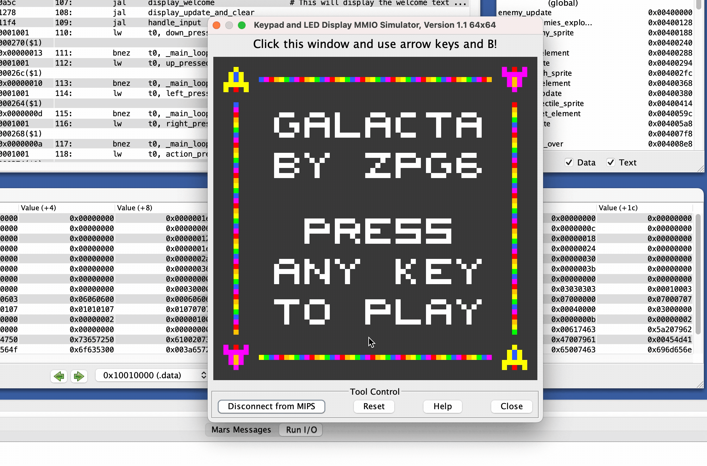
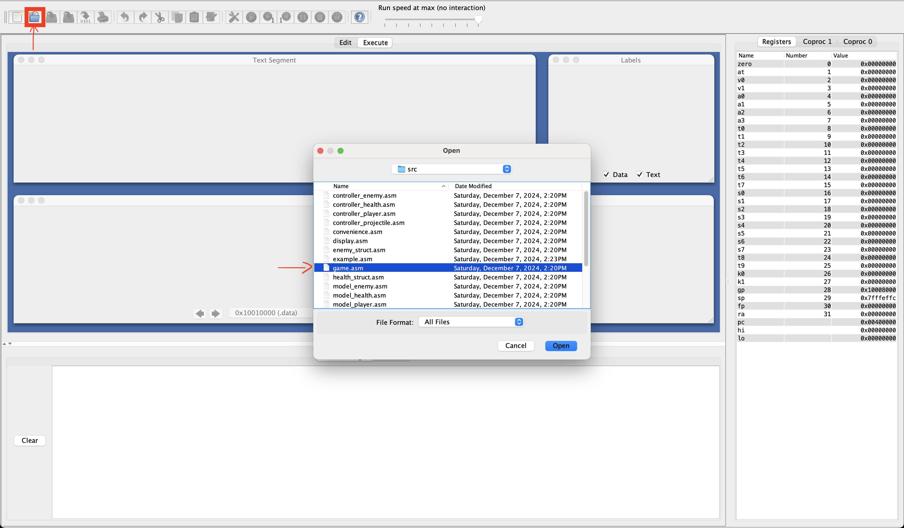
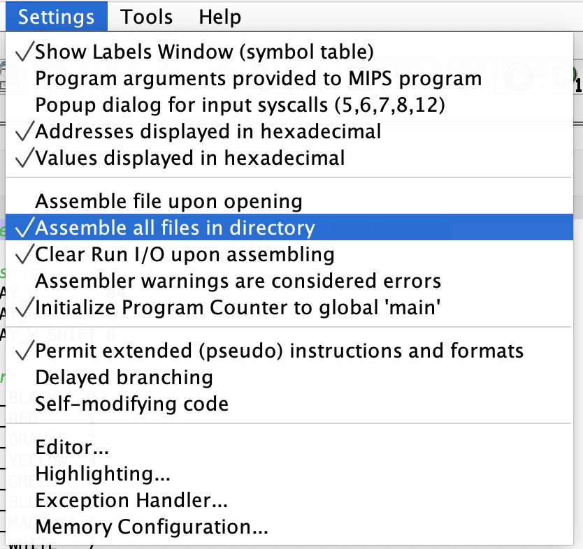
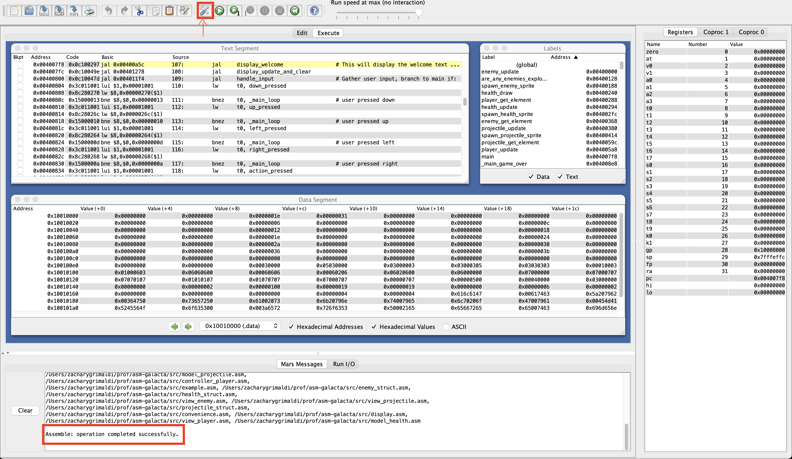
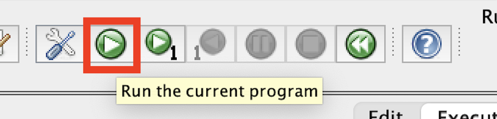
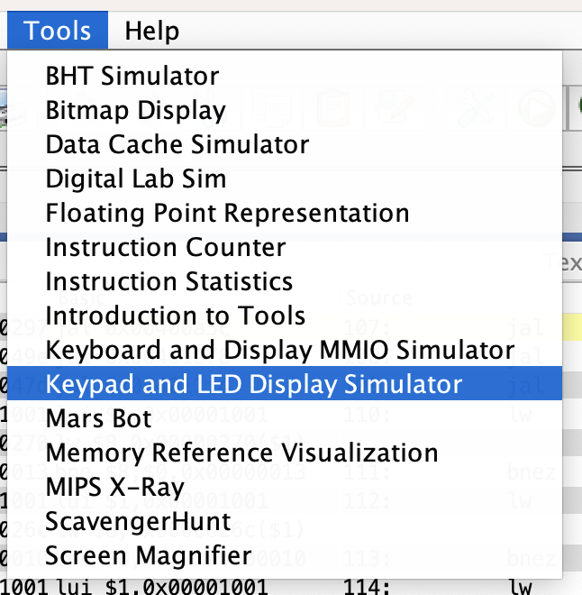
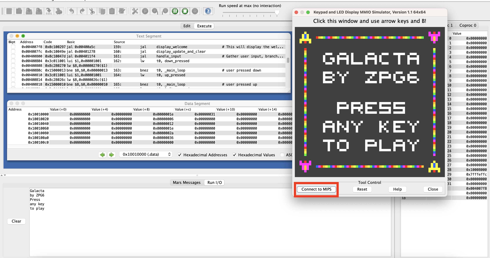
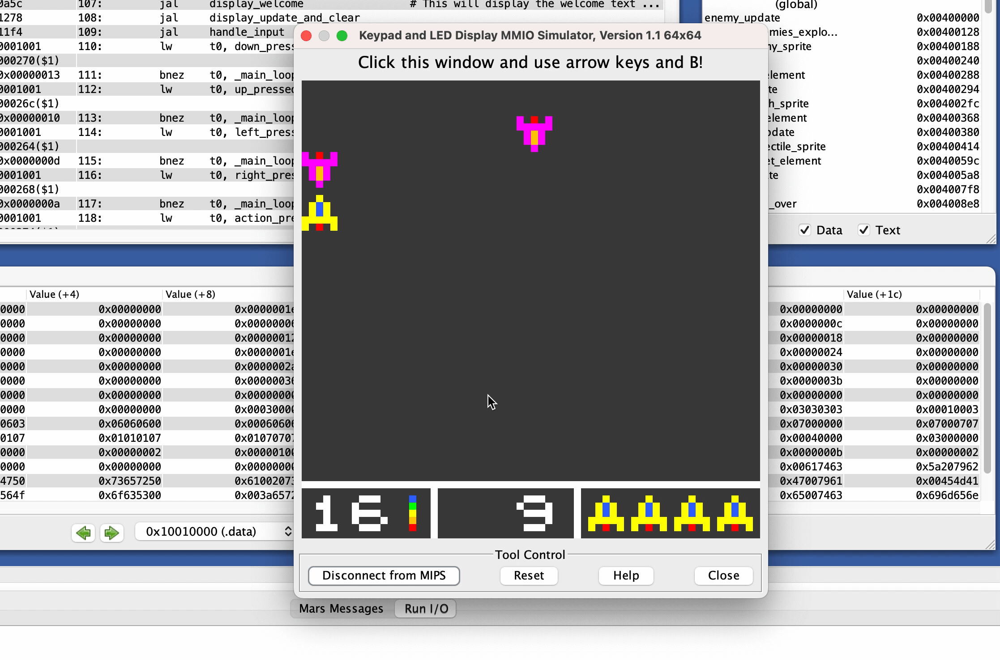

# asm-galacta

This was probably my favorite Computer Science project in college, and I have been wanting to revisit it for a while.

It is a simple game written in MIPS Assembly Language, runnable cross-platform using a Java runtime. The player controls a spaceship that can move left/right/up/down (arrow keys), and shoot projectiles at the enemies (B). It is loosely based on the classic arcade game [Galaga](https://en.wikipedia.org/wiki/Galaga).

Building this game was a great learning experience, and I am proud of the result to this day. About a year later was when I began learning app development in native iOS, and I can see now how this project was a stepping stone to that type of thinking.

<br>



## Features

- Welcome screen with animated rainbow border
- Keyboard input for player movement and shooting
- Enemy spawning locations and timing randomized
- HUD with ammo, score, and lives
- Explosion animations when an enemy is hit
- Health drops to restore lives
- Game over screen with final score

## Running the game

### Prerequisites

- Java 8+ (I used [Liberica JDK 21 LTS](https://bell-sw.com/pages/downloads/#jdk-21-lts))
- Clone this repository:

```
git clone https://github.com/zpg6/asm-galacta.git
```

<br>

### 1. Open the JAR for the MIPS Simulator (`tools/Mars.jar`) and open the `src/game.asm` file.

<br>


<br><br><br>

### 2. Be sure to select "Assemble All Files" in the Settings menu.

<br>


<br><br><br>

### 3. Click the "Assemble" button and then the "Run" button.

<br>


<br><br><br>

<br><br><br>

### 4. Open the "Keypad and LED Display Simulator" and click the "Connect to MIPS" button.

<br>


<br><br><br>

<br><br><br>

### 5. Play the game!

Use the arrow keys to move the spaceship and the B key to shoot. Try to get the highest score you can!

If you lose a life, collect a falling health orb to restore one.

<br>


